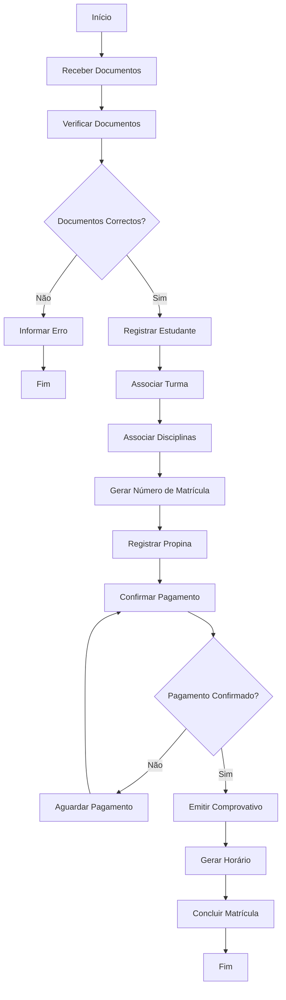
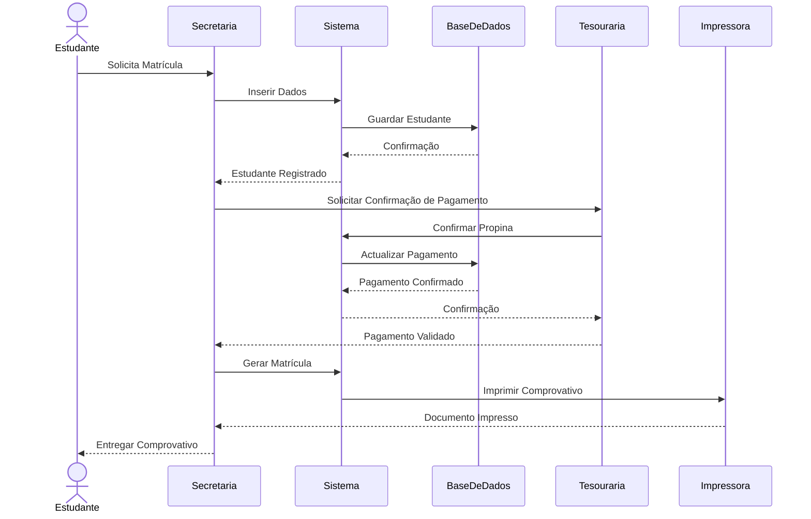
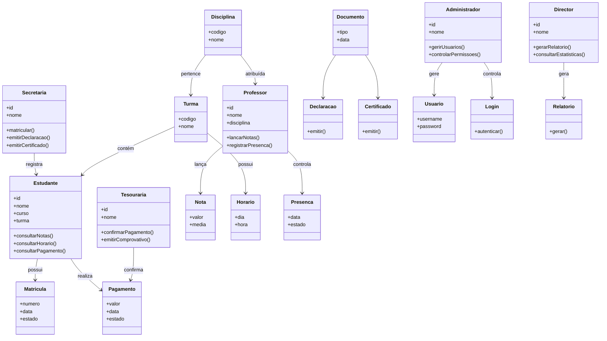

# sistema-secretaria-escolar

```mermaid
graph TD

A[Secretária] --> B[Matrícula de Estudantes]
A --> C[Gestão de Turmas]
A --> D[Gestão de Disciplinas]
A --> E[Emitir Declaração]
A --> F[Emitir Certificado]
A --> G[Gestão de Documentos]
A --> H[Consultar Estudantes]

I[Professor] --> J[Lançar Notas]
I --> K[Controle de Presença]
I --> L[Consultar Horários]
I --> M[Consultar Turmas]

N[Estudante] --> O[Consultar Notas]
N --> P[Solicitar Declaração]
N --> Q[Consultar Horários]
N --> R[Consultar Pagamentos]

S[Director] --> T[Gerar Relatórios]
S --> U[Consultar Estatísticas]
S --> V[Supervisionar Sistema]

W[Tesouraria] --> X[Gestão de Propinas]
W --> Y[Confirmar Pagamentos]
W --> Z[Emitir Comprovativos]

AA[Administrador] --> AB[Gestão de Utilizadores]
AA --> AC[Gerir Login]
AA --> AD[Controlar Permissões]
AA --> AE[Gerir Sistema]
```

```mermaid
flowchart TD

A[Início] --> B[Receber Documentos]
B --> C[Verificar Documentos]

C --> D{Documentos Correctos?}

D -- Não --> E[Informar Erro]
E --> F[Fim]

D -- Sim --> G[Registrar Estudante]

G --> H[Associar Turma]
H --> I[Associar Disciplinas]

I --> J[Gerar Número de Matrícula]

J --> K[Registrar Propina]

K --> L[Confirmar Pagamento]

L --> M{Pagamento Confirmado?}

M -- Não --> N[Aguardar Pagamento]
N --> L

M -- Sim --> O[Emitir Comprovativo]

O --> P[Gerar Horário]

P --> Q[Concluir Matrícula]

Q --> R[Fim]
```

```mermaid
sequenceDiagram

actor Estudante
participant Secretaria
participant Sistema
participant BaseDeDados
participant Tesouraria
participant Impressora

Estudante->>Secretaria: Solicita Matrícula

Secretaria->>Sistema: Inserir Dados

Sistema->>BaseDeDados: Guardar Estudante

BaseDeDados-->>Sistema: Confirmação

Sistema-->>Secretaria: Estudante Registrado

Secretaria->>Tesouraria: Solicitar Confirmação de Pagamento

Tesouraria->>Sistema: Confirmar Propina

Sistema->>BaseDeDados: Actualizar Pagamento

BaseDeDados-->>Sistema: Pagamento Confirmado

Sistema-->>Tesouraria: Confirmação

Tesouraria-->>Secretaria: Pagamento Validado

Secretaria->>Sistema: Gerar Matrícula

Sistema->>Impressora: Imprimir Comprovativo

Impressora-->>Secretaria: Documento Impresso

Secretaria-->>Estudante: Entregar Comprovativo
```

```mermaid
classDiagram

class Estudante{
  +id
  +nome
  +curso
  +turma
  +consultarNotas()
  +consultarHorario()
  +consultarPagamento()
}

class Professor{
  +id
  +nome
  +disciplina
  +lancarNotas()
  +registrarPresenca()
}

class Secretaria{
  +id
  +nome
  +matricular()
  +emitirDeclaracao()
  +emitirCertificado()
}

class Director{
  +id
  +nome
  +gerarRelatorio()
  +consultarEstatisticas()
}

class Tesouraria{
  +id
  +nome
  +confirmarPagamento()
  +emitirComprovativo()
}

class Administrador{
  +id
  +nome
  +gerirUsuarios()
  +controlarPermissoes()
}

class Matricula{
  +numero
  +data
  +estado
}

class Pagamento{
  +valor
  +data
  +estado
}

class Nota{
  +valor
  +media
}

class Turma{
  +codigo
  +nome
}

class Disciplina{
  +codigo
  +nome
}

class Horario{
  +dia
  +hora
}

class Presenca{
  +data
  +estado
}

class Documento{
  +tipo
  +data
}

class Declaracao{
  +emitir()
}

class Certificado{
  +emitir()
}

class Usuario{
  +username
  +password
}

class Login{
  +autenticar()
}

class Relatorio{
  +gerar()
}

Secretaria --> Estudante : registra
Estudante --> Matricula : possui
Estudante --> Pagamento : realiza
Professor --> Nota : lança
Professor --> Presenca : controla
Turma --> Horario : possui
Disciplina --> Professor : atribuída
Tesouraria --> Pagamento : confirma
Administrador --> Usuario : gere
Administrador --> Login : controla
Director --> Relatorio : gera
Documento --> Declaracao
Documento --> Certificado
Turma --> Estudante : contém
Disciplina --> Turma : pertence
```
