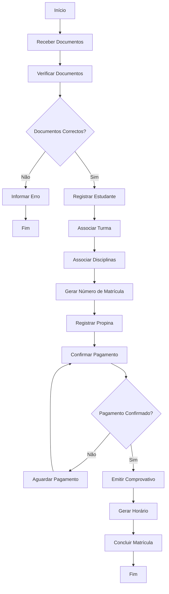
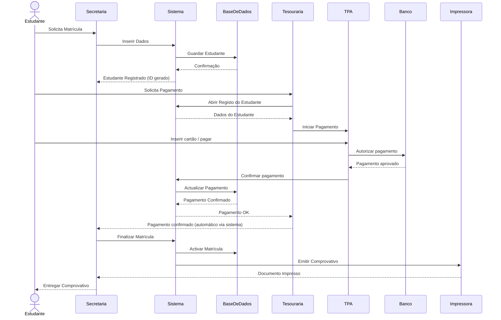

# sistema-secretaria-escolar

```mermaid
graph TD

A[Secretária] --> B[Matrícula de Estudantes]
A --> C[Gestão de Turmas]
A --> D[Gestão de Disciplinas]
A --> E[Emitir Declaração]
A --> F[Emitir Certificado]
A --> G[Gestão de Documentos]
A --> H[Consultar Estudantes]

I[Professor] --> J[Lançar Notas]
I --> K[Controle de Presença]
I --> L[Consultar Horários]
I --> M[Consultar Turmas]

N[Estudante] --> O[Consultar Notas]
N --> P[Solicitar Declaração]
N --> Q[Consultar Horários]
N --> R[Consultar Pagamentos]

S[Director] --> T[Gerar Relatórios]
S --> U[Consultar Estatísticas]
S --> V[Supervisionar Sistema]

W[Tesouraria] --> X[Gestão de Propinas]
W --> Y[Confirmar Pagamentos]
W --> Z[Emitir Comprovativos]

AA[Administrador] --> AB[Gestão de Utilizadores]
AA --> AC[Gerir Login]
AA --> AD[Controlar Permissões]
AA --> AE[Gerir Sistema]
```

## 📌 Descrição do Sistema

O Sistema de Secretaria Escolar é uma aplicação desenvolvida para informatizar e organizar os processos administrativos e académicos de uma instituição de ensino.

O sistema permite gerir estudantes, professores, turmas, disciplinas, notas, pagamentos e documentos académicos, reduzindo o uso de processos manuais e melhorando a eficiência da secretaria.

---

## 🎯 Objectivos do Sistema

- Automatizar processos administrativos escolares  
- Melhorar o controlo de estudantes e professores  
- Facilitar a emissão de documentos oficiais  
- Organizar pagamentos e propinas  
- Centralizar informações académicas  
- Melhorar a comunicação entre sectores da escola  

---

## 👥 Actores do Sistema

- Secretária  
- Estudante  
- Professor  
- Director  
- Tesouraria  
- Administrador  

---

## ⚙️ Funcionalidades do Sistema

- Matrícula de estudantes  
- Gestão de propinas  
- Emissão de declarações  
- Emissão de certificados  
- Gestão de notas  
- Gestão de turmas  
- Gestão de disciplinas  
- Gestão de horários  
- Controle de presença  
- Gestão de documentos  
- Gestão de utilizadores/login  
- Geração de relatórios  
---

## 🧩 5. Diagrama de Caso de Uso

Este diagrama representa as funcionalidades do sistema e a forma como cada utilizador (actor) interage com ele.

Cada ligação indica uma acção que o utilizador pode executar dentro do sistema de secretaria escolar.

### 👉 Em resumo:
- Mostra quem faz o quê no sistema  
- Representa os requisitos funcionais  
- Ajuda a entender o sistema do ponto de vista do utilizador  

---

---
## 🔄 6. Diagrama de Actividade

Este diagrama mostra o fluxo de execução de um processo dentro do sistema, neste caso o processo de matrícula de um estudante.

### 👉 Em resumo:
- Mostra passo a passo de um processo  
- Inclui decisões (Sim / Não)  
- Representa o comportamento do sistema  

### 📌 Interpretação:
O processo começa com a recepção dos documentos e termina quando a matrícula é concluída.

---

---
## 📡 7. Diagrama de Sequência

Este diagrama mostra como os diferentes componentes do sistema comunicam entre si durante a execução de uma tarefa.

Neste caso, a emissão de matrícula e comprovativo.

### 👉 Em resumo:
- Mostra a ordem das mensagens  
- Mostra quem fala com quem  
- Mostra o fluxo temporal do sistema  

### 📌 Interpretação:
A secretária interage com o sistema, que por sua vez comunica com a base de dados, tesouraria e impressora.

---

---
## 🏗️ 8. Diagrama de Classes

Este diagrama representa a estrutura do sistema em termos de objectos (classes), atributos e relações.

### 👉 Em resumo:
- Mostra como o sistema é construído internamente  
- Define entidades do sistema  
- Representa a base da programação (POO)  

### 📌 Interpretação:
Cada classe representa uma entidade real do sistema escolar.
---

